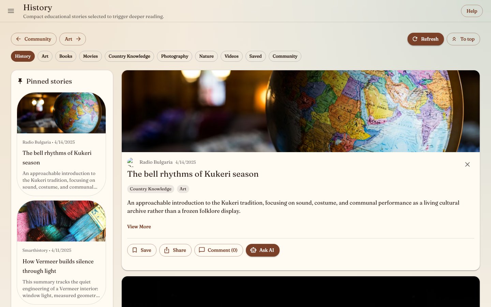
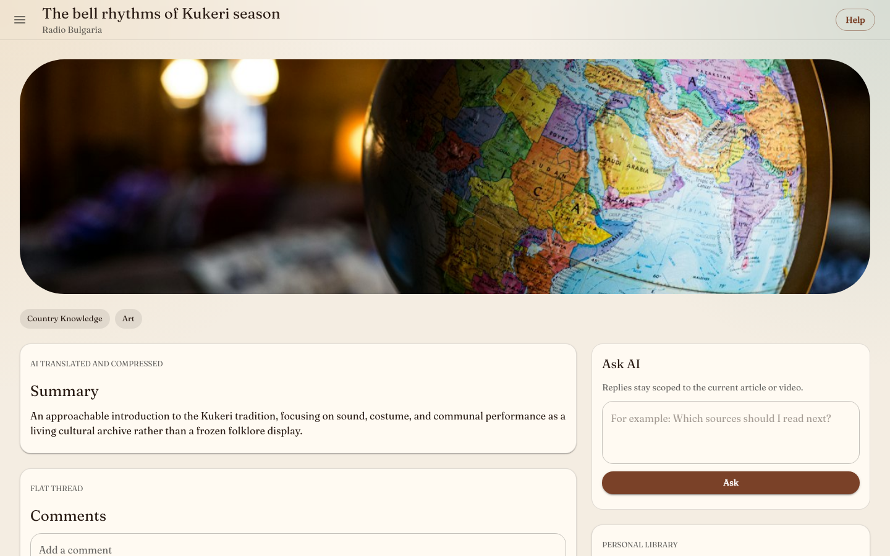
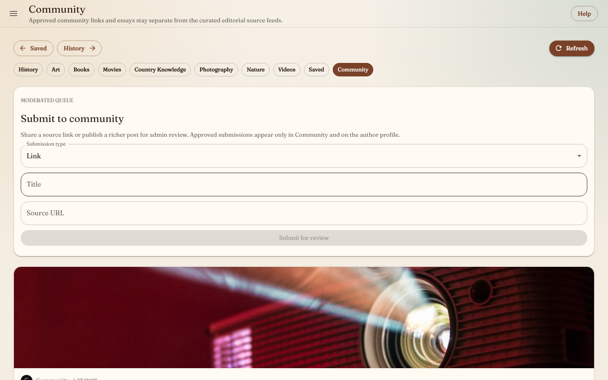
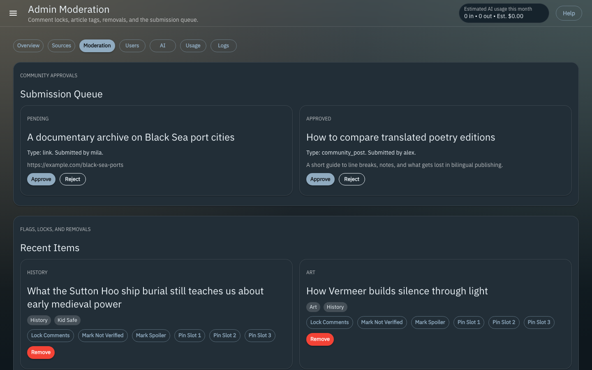

# Fieldguide Educational Feed Educational Feed

Fieldguide Educational Feed is a full-stack educational social feed for history, art, books, movies, country knowledge, photography, nature, and educational video. It ships curated editorial feeds separately from moderated community posts, with EN/BG content modes, saved libraries, albums, flat comments, Ask-AI, newsletters, and an admin console for sources, moderation, users, AI budgets, and logs.



## Screenshots

| Feed | Item detail |
| --- | --- |
|  |  |

| Community | Admin moderation |
| --- | --- |
|  |  |

## Stack

- `apps/web`: Next.js App Router, React, MUI, Redux Toolkit + RTK Query, i18next.
- `apps/api`: Fastify, secure cookie sessions, Prisma/MySQL persistence, Pino logs.
- `apps/worker`: BullMQ worker for ingestion, AI enrichment, manual generated-story drafts, newsletter selection, and email jobs.
- `packages/shared`: Zod schemas, DTOs, source registry, optional UI fixtures, and shared AI utilities.

## Implemented Scope

- Curated subject feeds, saved feed, community feed, item detail pages, share links, hidden items, and pinned rails.
- Auth, password recovery, role-based admin access, profiles, settings, protected Kid/Adult mode switching, and per-user preferences.
- Albums with create, rename, delete, cover selection, item removal, and manual ordering.
- Flat comments with author edit windows, admin deletion, and per-item locking.
- RSS, YouTube RSS, and adapter-backed ingestion with dedupe, metadata extraction, AI summary/translation/classification, and worker scheduling.
- Ask-AI per item with content-mode enforcement and provider/model/budget controls.
- Admin-only manual AI story generation that creates cited, verifier-scored drafts under a hard monthly cap; drafts require explicit admin approval before publishing.
- Opt-in newsletters with weekly/daily cadence, viewed/saved/hidden preference ranking, AI-assisted item selection, and audit metadata.
- Admin source CRUD/resync/delete, submission review, item pinning/removal/tagging, user role/suspend controls, AI settings, budget status, and error logs.

## Quick Start: Database Mode

One-command bootstrap for a new machine:

```bash
npm run setup:new-device
```

This script:
- creates `.env` from `.env.example` if needed
- asks for setup mode, admin seed password, optional AI provider keys/models, and optional email settings
- generates a local `COOKIE_SECRET`
- generates `SEED_USER_PASSWORD` if you leave the prompt blank
- installs npm dependencies
- starts MySQL and Redis
- runs Prisma generate, migrate, and seed

Useful variants:

```bash
npm run setup:new-device:demo
npm run setup:new-device -- --playwright
npm run setup:new-device -- --seed-password your-local-admin-password
npm run setup:new-device -- --build --start
```

Database mode is the default run path. It starts MySQL and Redis, boots the approved source registry, and the worker queues immediate ingestion for active RSS, YouTube RSS, and approved adapter-backed sources.

```bash
cp .env.example .env
docker compose up -d
npm install
npm run prisma:generate
npm run prisma:migrate
npm run seed
npm run dev
```

Open:

- Web: [http://localhost:3000](http://localhost:3000)
- API health: [http://localhost:4000/health](http://localhost:4000/health)

Use `localhost` consistently for the web and API while testing auth. Browser cookies are host-scoped, so mixing `127.0.0.1:3000` with `localhost:4000` can make the app appear signed out even after a successful login.

`npm run dev` and `npm run start` now supervise the full stack. In database mode they bring up `docker compose` automatically, start API/worker/web together, and run `docker compose down` when you stop with `Ctrl+C`, `SIGTERM`, `SIGHUP`, or by closing the terminal. In `DEMO_MODE=true`, the same runner skips Docker entirely.

The supervisor can also auto-shutdown the stack after user inactivity. Set `AUTO_SHUTDOWN_ENABLED=true` and adjust `AUTO_SHUTDOWN_IDLE_HOURS` in `.env`. Activity is driven by real browser interaction beacons, not background polling.

For repo-managed runtime settings, `/Users/donetianpetkov/feed/.env` is the source of truth. Inherited shell variables like `OPENAI_API_KEY` are cleared for this project unless they are explicitly present in the repo `.env`.

The default database seed creates local accounts, the source registry, and AI config only. Set `SEED_USER_PASSWORD` in `.env` before running `npm run seed`; the admin username is `admin`. The source registry is also bootstrapped automatically by the API and worker at startup. It does not insert bundled fixture articles.

To intentionally load bundled UI fixtures into MySQL for development screenshots, run `SEED_DEMO_CONTENT=true npm run seed`. To allow the web app to show bundled fixture data when the API is empty or unavailable, set `NEXT_PUBLIC_DEMO_FALLBACK=true`; this is off by default.

Prisma workspace scripts load the repo-root `.env`, so you do not need to duplicate `DATABASE_URL` inside `apps/api/.env`. The Docker MySQL init script creates both `fieldguide` and `fieldguide_shadow`; Prisma uses the shadow database during `migrate dev`.

If you already had a Docker volume from before the shadow database was added, create/grant it once:

```bash
docker exec -i fieldguide-mysql mysql -uroot -proot -e "CREATE DATABASE IF NOT EXISTS fieldguide_shadow; GRANT ALL PRIVILEGES ON fieldguide_shadow.* TO 'fieldguide'@'%'; FLUSH PRIVILEGES;"
```

## Fixture Mode

Fixture mode is available for isolated UI work without MySQL or Redis. Set `DEMO_MODE=true` and `NEXT_PUBLIC_DEMO_FALLBACK=true` in `.env`, then run:

```bash
npm install
npm run dev
```

Useful service commands:

```bash
npm run dev:web
npm run dev:api
npm run dev:worker
npm run start
```

## Verification

```bash
npm test
npm run build
npm run test:e2e
```

When the API and web app are already running, use the web workspace command directly:

```bash
npm run test:e2e -w @edu-feed/web
```

Current automated coverage includes shared schema/source tests, API route tests for admin-only generated-story draft approval, worker newsletter-ranking tests, web theme tests, and Playwright flows for auth, password reset, feeds, Ask-AI, settings, albums, saved/hidden state, sharing, admin AI, user management, source CRUD, pinning, moderation, community approval, and comment locking.

## Screenshots

Screenshots are reproducible from the built fixture app:

```bash
npm run build
npm run screenshots
```

The capture script starts the built API and web app in fixture mode, logs in as seeded local users, and writes PNGs to `docs/screenshots`.

## Main Routes

- App: `/`, `/feed/[subject]`, `/item/[slug]`, `/saved`, `/albums/[id]`, `/community`, `/profile/[username]`, `/settings`.
- Admin: `/admin`, `/admin/sources`, `/admin/moderation`, `/admin/users`, `/admin/ai`, `/admin/usage`, `/admin/logs`.
- API: `/v1/auth/*`, `/v1/me`, `/v1/feed`, `/v1/items/:id`, `/v1/albums`, `/v1/submissions`, `/v1/admin/*`, `/v1/admin/generated-stories`.

## Notes

- User-facing failures are toast/alert-level only; stack traces and integration failures are logged server-side and surfaced in admin logs.
- External article/video pages link out to originals and do not republish full scraped bodies; community posts render their own full body.
- Email and AI providers are configuration-driven. Without real credentials, provider-backed AI controls are hidden or rejected instead of exposing unavailable actions.
