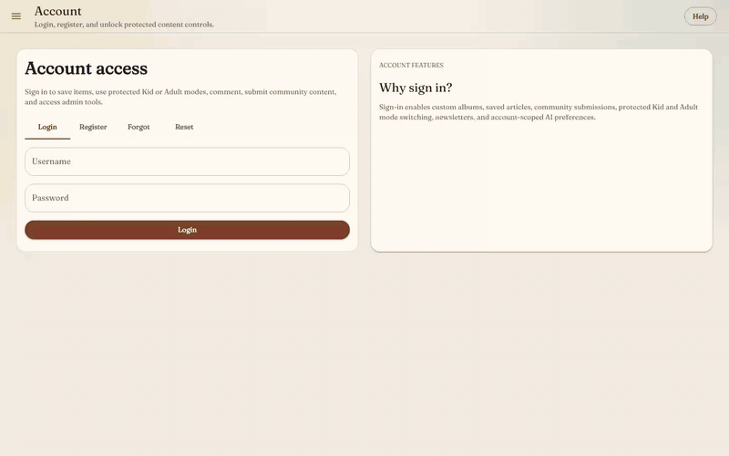
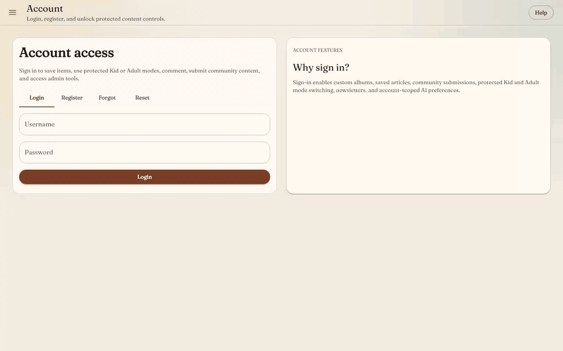
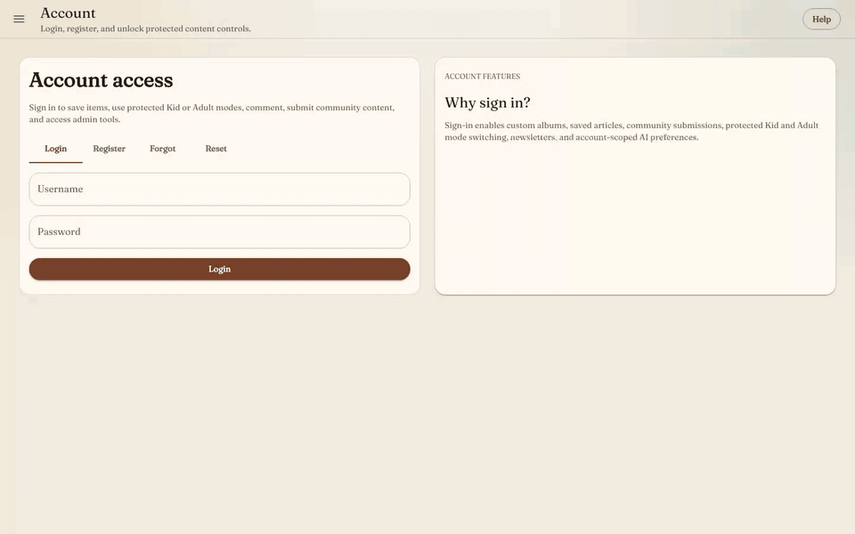
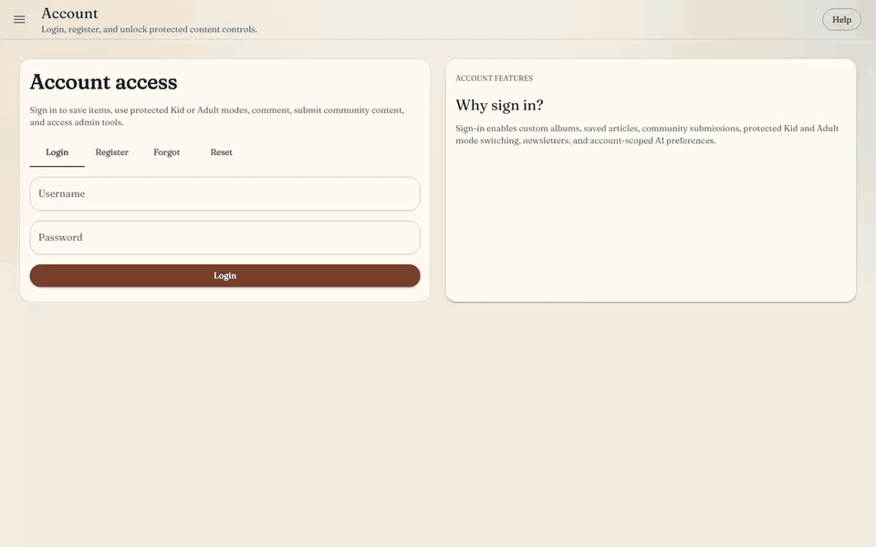
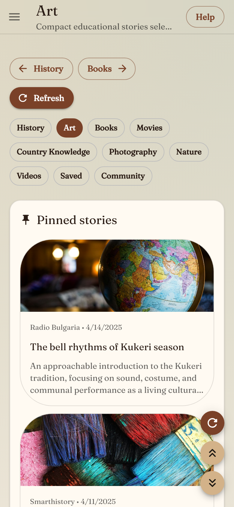
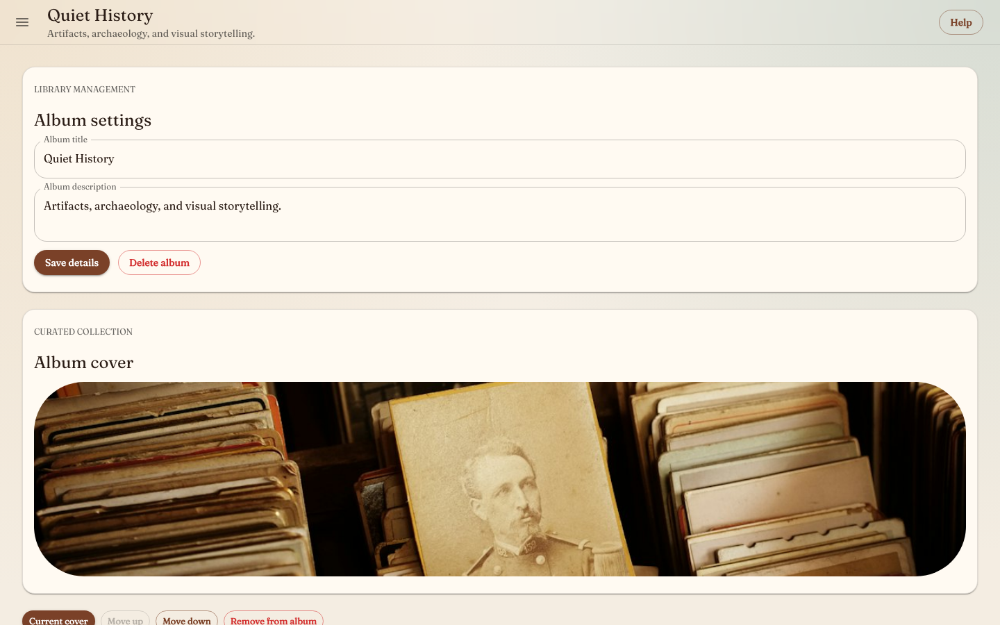
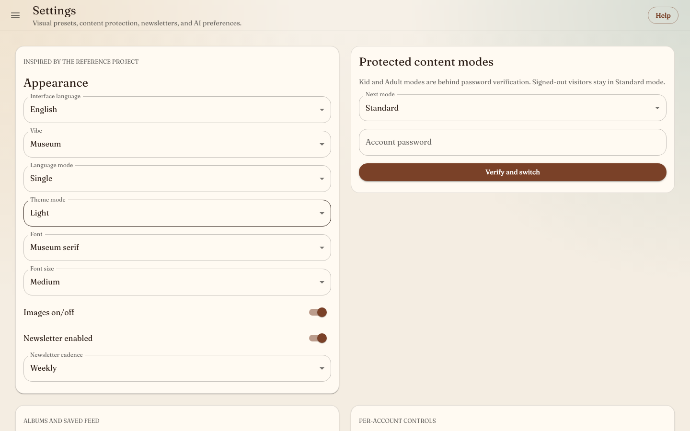
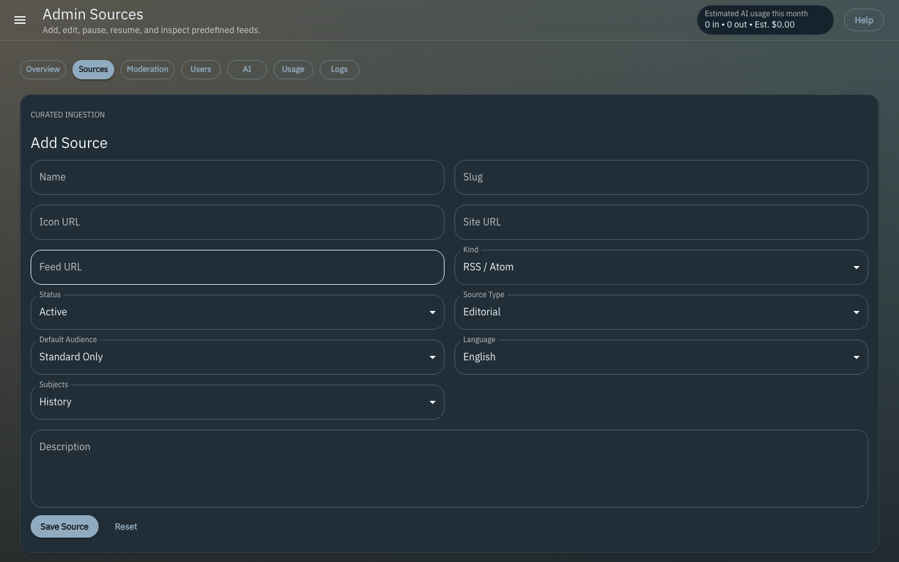

# Educational Social Feed

Educational Social Feed is a full-stack educational social feed for history, art, books, movies, country knowledge, photography, nature, and educational video. Curated editorial feeds sit apart from moderated community posts, with EN/BG content modes, saved libraries, albums, flat comments, Ask-AI, newsletters, and an admin console for sources, moderation, users, AI budgets, and logs.



A sharper version of this walkthrough is in [full-tour.mp4](docs/screenshots/full-tour.mp4) (44 seconds, 1280px).

## See it in action

| Ask-AI on an article | Browse and share |
| --- | --- |
|  |  |

| Admin console | Mobile |
| --- | --- |
|  |  |

| History feed | Item detail |
| --- | --- |
|  |  |

| Albums | Community |
| --- | --- |
|  |  |

| Settings | Admin moderation |
| --- | --- |
|  |  |

| Admin sources | |
| --- | --- |
|  | |

## What's inside

| Workspace | Tech | Role |
| --- | --- | --- |
| `apps/web` | Next.js App Router, React, MUI, Redux Toolkit + RTK Query, i18next | The site and admin console |
| `apps/api` | Fastify, secure cookie sessions, Prisma/MySQL, Pino logs | REST API under `/v1` |
| `apps/worker` | BullMQ on Redis | Ingestion, AI enrichment, generated-story drafts, newsletter selection, email |
| `packages/shared` | Zod | Schemas, DTOs, source registry, optional UI fixtures, shared AI utilities |

## Features

- **Feeds:** curated subject feeds, saved feed, community feed, item pages, share links, hidden items, and pinned rails.
- **Accounts:** auth, password recovery, role-based admin access, profiles, settings, per-user preferences, and password-protected Kid/Adult mode switching.
- **Library:** albums with create, rename, delete, cover selection, item removal, and manual ordering.
- **Comments:** flat threads with an author edit window, admin deletion, and per-item locking.
- **Ingestion:** RSS, YouTube RSS, and adapter-backed sources with dedupe, metadata extraction, AI summary/translation/classification, and scheduled polling.
- **AI:** per-item Ask-AI that respects the viewer's content mode, with provider/model/budget controls (OpenAI, Anthropic, OpenRouter, or a local Ollama). Admins can also generate cited, verifier-scored story drafts under a hard monthly cap; drafts never publish without explicit approval.
- **Newsletters:** opt-in daily or weekly digests ranked by what each reader viewed, saved, and hid, with AI-assisted selection and audit metadata.
- **Admin:** source create/edit/pause/resync/delete, submission review, item pinning/removal/tagging, user roles and suspension, AI settings, budget status, and error logs.

Without real credentials, AI and email features are hidden or rejected rather than shown in a broken state. User-facing failures show as toasts; stack traces go to server logs and the admin log view. Article and video items link out to the original rather than republishing scraped bodies; community posts show their own full text.

## Quick start

Requires Node 22.14+ and npm 10.9+. Database mode (the default) also needs Docker for MySQL and Redis.

### One command

```bash
npm run setup:new-device
```

This creates `.env` from `.env.example`, asks for the setup mode, admin seed password, optional AI keys/models, and optional email settings, generates `COOKIE_SECRET` (and `SEED_USER_PASSWORD` if you leave it blank), installs dependencies, starts MySQL and Redis, and runs Prisma generate, migrate, and seed.

Handy flags:

```bash
npm run setup:new-device:demo                                # fixture mode, skips Docker/Prisma/seed
npm run setup:new-device -- --playwright                     # also install Playwright browsers
npm run setup:new-device -- --seed-password your-password    # set the admin seed password up front
npm run setup:new-device -- --build --start                  # build, then start the stack
npm run setup:new-device -- --non-interactive                # use defaults and flags, no prompts
```

### By hand

```bash
cp .env.example .env
docker compose up -d
npm install
npm run prisma:generate
npm run prisma:migrate
npm run seed
npm run dev
```

Then open the web app at [http://localhost:3000](http://localhost:3000) and API health at [http://localhost:4000/health](http://localhost:4000/health).

Use `localhost` for both the web app and the API. Cookies are tied to the host name, so mixing `127.0.0.1:3000` with `localhost:4000` makes you look signed out even after a successful login.

## Running the stack

`npm run dev` and `npm run start` supervise everything. In database mode they run `docker compose up`, start the API, worker, and web app together, and run `docker compose down` when you stop with `Ctrl+C`, `SIGTERM`, `SIGHUP`, or by closing the terminal. With `DEMO_MODE=true` they skip Docker entirely.

To start one service on its own: `npm run dev:web`, `npm run dev:api`, or `npm run dev:worker`.

The supervisor can also shut the stack down after a period with no real browser interaction (background polling doesn't count). Set `AUTO_SHUTDOWN_ENABLED=true` and adjust `AUTO_SHUTDOWN_IDLE_HOURS` in `.env`.

On startup the API and worker load the approved source registry, and the worker immediately queues ingestion for every active RSS, YouTube RSS, and adapter-backed source.

## Configuration

The repo-root `.env` is the single source of truth. Shell variables such as `OPENAI_API_KEY` that you've exported elsewhere are ignored for this project unless they're also in `.env`. Prisma scripts read the same root file, so there's no need for an `apps/api/.env`.

| Setting | What it does |
| --- | --- |
| `SEED_USER_PASSWORD` | Password for the seeded accounts. Set it before `npm run seed`. The admin username is `admin`. |
| `OPENAI_API_KEY`, `ANTHROPIC_API_KEY`, `OPENROUTER_API_KEY`, `OLLAMA_BASE_URL` | AI providers. Pick the default with `DEFAULT_AI_PROVIDER`; models via `SUMMARY_MODEL`, `TRANSLATION_MODEL`, `ASK_MODEL`, `NEWSLETTER_MODEL`. |
| `RESEND_API_KEY`, `EMAIL_FROM`, `ENABLE_EMAIL` | Outgoing email. Off by default. |
| `DEMO_MODE` | `true` runs the API from bundled fixtures with no MySQL or Redis. |
| `NEXT_PUBLIC_DEMO_FALLBACK` | `true` lets the web app show bundled fixtures when the API is empty or unreachable. Off by default. |
| `AUTO_SHUTDOWN_ENABLED`, `AUTO_SHUTDOWN_IDLE_HOURS` | Idle shutdown for the supervised stack. |

The default seed creates local accounts, the source registry, and AI config only; it does not insert sample articles. To load the bundled fixture articles into MySQL (useful for screenshots), run `SEED_DEMO_CONTENT=true npm run seed`.

The Docker MySQL init script creates both `fieldguide` and `fieldguide_shadow`; Prisma uses the shadow database during `migrate dev`. If your Docker volume predates the shadow database, create it once:

```bash
docker exec -i fieldguide-mysql mysql -uroot -proot -e "CREATE DATABASE IF NOT EXISTS fieldguide_shadow; GRANT ALL PRIVILEGES ON fieldguide_shadow.* TO 'fieldguide'@'%'; FLUSH PRIVILEGES;"
```

### Fixture mode

For UI work without MySQL or Redis, set `DEMO_MODE=true` and `NEXT_PUBLIC_DEMO_FALLBACK=true` in `.env`, then run `npm install && npm run dev`. The fixture accounts are `alex`, `mila`, and `admin`, all with the password `fieldguide123`.

## Testing

```bash
npm test          # unit tests: shared schemas/sources, API routes, worker newsletter ranking and job ids, web themes
npm run build
npm run test:e2e  # builds, then runs Playwright against the API in fixture mode
```

The Playwright suite covers auth, password reset, feeds, Ask-AI, settings, albums, saved and hidden items, sharing, admin AI, user management, source CRUD, pinning, moderation, community approval, and comment locking. It starts its own API (in fixture mode) and web server, regardless of what `.env` says.

If ports 3000/4000 are taken, run it elsewhere. The web app bakes in the API address at build time, so rebuild it first:

```bash
NEXT_PUBLIC_API_URL=http://localhost:4100 npm run build -w @edu-feed/web
E2E_WEB_PORT=3100 E2E_API_PORT=4100 npm run test:e2e -w @edu-feed/web
```

If the API and web app are already running, `PW_USE_EXISTING_SERVERS=true npm run test:e2e -w @edu-feed/web` reuses them.

## Screenshots and GIFs

Everything in `docs/screenshots` is reproducible from the built fixture app:

```bash
npm run build
npm run screenshots
```

The script starts the built API and web app in fixture mode, signs in as the fixture users, and writes PNGs, short GIF clips, and the full walkthrough (`full-tour.mp4` and `full-tour.gif`) to `docs/screenshots`. GIFs need `ffmpeg` on your `PATH` (skip them with `SKIP_GIFS=true`). To use other ports, set `SCREENSHOT_WEB_URL` and `SCREENSHOT_API_URL` and build the web app with the matching `NEXT_PUBLIC_API_URL`.

## Routes

- **App:** `/`, `/feed/[subject]`, `/item/[slug]`, `/saved`, `/albums/[id]`, `/community`, `/profile/[username]`, `/settings`
- **Admin:** `/admin`, `/admin/sources`, `/admin/moderation`, `/admin/users`, `/admin/ai`, `/admin/usage`, `/admin/logs`
- **API:** `/v1/auth/*`, `/v1/me`, `/v1/feed`, `/v1/items/:id`, `/v1/albums`, `/v1/submissions`, `/v1/admin/*`, `/v1/admin/generated-stories`
